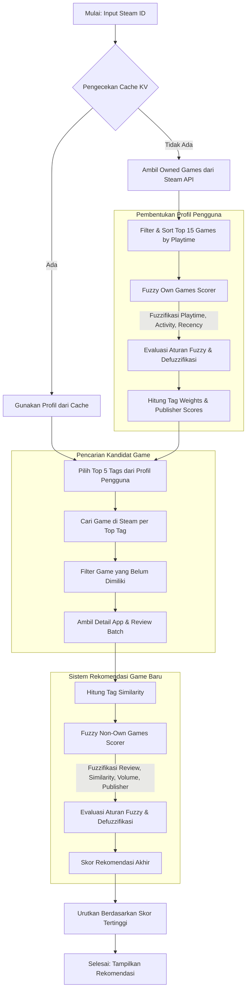

# Laporan Akhir: Algoritma Steam Game Recommender

Laporan ini mendokumentasikan alur kerja program, perhitungan algoritma *Fuzzy Logic*, representasi matematis, dan implementasi kode pada Steam Game Recommender.

## 1. Flowchart Keseluruhan Sistem

Flowchart di bawah ini menjelaskan alur sistem, mulai dari memuat profil pengguna dari Steam hingga menghasilkan rekomendasi akhir.



---

## 2. Detail Proses dan Algoritma

Sistem ini membagi algoritma menjadi dua tahap *Fuzzy Logic*: Evaluasi game yang dimiliki (untuk membentuk profil) dan evaluasi game kandidat (untuk rekomendasi).

### A. Pembentukan Profil Pengguna (Fuzzy Own Games Scorer)

Untuk memahami preferensi pengguna, sistem menilai tingkat "kesukaan" terhadap 15 game teratas mereka berdasarkan metrik waktu bermain (*playtime*).

**1. Fuzzifikasi**
Sistem menggunakan **Trapezoidal Membership Function (TrapMF)** untuk memetakan input (seperti *playtime*, aktivitas 2 minggu terakhir, dan jarak sejak terakhir bermain) ke dalam himpunan fuzzy (misalnya: *tidak_dimainkan, dicoba, cukup, sering, sangat_banyak*).

Persamaan matematis untuk fungsi TrapMF:
$$
\mu(x; a,b,c,d) = \begin{cases} 
0 & \text{if } x \leq a \text{ or } x \geq d \\ 
\frac{x - a}{b - a} & \text{if } a < x < b \\ 
1 & \text{if } b \leq x \leq c \\ 
\frac{d - x}{d - c} & \text{if } c < x < d 
\end{cases}
$$

*Snippet Code Implementation (`src/lib/fuzzy-own-games-scorer.ts`):*
```typescript
private trapMF(x: number, a: number, b: number, c: number, d: number): number {
  if (x <= a || x >= d) return 0;
  if (x >= b && x <= c) return 1;
  if (x > a && x < b) return (x - a) / (b - a);
  if (x > c && x < d) return (d - x) / (d - c);
  return 0;
}
```

**2. Defuzzifikasi**
Skor kesukaan game dihitung menggunakan **Weighted Average Defuzzification**. Nilai aktivasi ($\alpha_i$) dari setiap aturan dikalikan dengan bobot output dari aturan tersebut ($w_i$), lalu dibagi dengan total nilai aktivasi.

$$
\text{Score} = \frac{\sum_{i=1}^{n} (\alpha_i \cdot w_i)}{\sum_{i=1}^{n} \alpha_i}
$$

*Snippet Code Implementation:*
```typescript
let numerator = 0;
let denominator = 0;
for (const key in activation) {
  const k = key as keyof typeof activation;
  if (activation[k] > 0) {
    numerator += activation[k] * weights[k];
    denominator += activation[k];
  }
}
const score = denominator > 0 ? numerator / denominator : 0.5;
```

---

### B. Perhitungan Kemiripan Tag (Weighted Tag Similarity)

Setelah profil terbentuk, setiap tag dari game pengguna mendapatkan bobot (`tagWeight`). Ketika mengevaluasi game kandidat, kemiripan dihitung berdasarkan interseksi tag antara game kandidat dengan profil pengguna, lalu dinormalisasi dengan total bobot maksimal yang mungkin.

$$
\text{Similarity} = \frac{\sum_{t \in T_{c} \cap T_{u}} W_u(t)}{\sum_{i=1}^{|T_c \cap T_u|} W_{u, \text{sorted}}[i]}
$$

*Di mana:*
- $T_c$: Himpunan tag game kandidat.
- $T_u$: Himpunan tag pengguna.
- $W_u(t)$: Bobot tag $t$ pada profil pengguna.
- $W_{u, \text{sorted}}$: Array bobot pengguna yang diurutkan secara menurun (*descending*).

*Snippet Code Implementation (`src/lib/simple-recommendation.ts`):*
```typescript
export function calculateWeightedSimilarity(candidateTags: string[], userTagWeights: Record<string, number>): number {
  // ... (setup dan normalisasi tag)
  const set1 = new Set(allowedCandidateTags.map((t) => t.toLowerCase()));
  let intersectionWeight = 0;

  for (const tag of set1) {
    if (lowerTagWeights[tag]) {
      intersectionWeight += lowerTagWeights[tag];
    }
  }

  const sortedWeights = Object.values(allowedUserTagWeights).sort((a, b) => b - a);
  const maxPossibleWeight = sortedWeights.slice(0, set1.size).reduce((sum, w) => sum + w, 0);

  return maxPossibleWeight > 0 ? intersectionWeight / maxPossibleWeight : 0;
}
```

---

### C. Penentuan Skor Rekomendasi Akhir (Fuzzy Non-Own Games Scorer)

Skor rekomendasi akhir menggunakan *Fuzzy Logic* untuk mengevaluasi empat variabel: `review_positivity`, `tag_similarity`, `review_volume` (dalam $\log_{10}$), dan `publisher_score`.

**1. Inferensi Aturan**
Sistem menggunakan konjungsi AND ($\min$) untuk menggabungkan anteseden.

Contoh aturan (R1): *IF similarity is sangat_cocok AND review is sangat_bagus AND volume is banyak THEN rekomendasi is SANGAT_TINGGI.*
$$
\alpha_1 = \min\left( \mu_{\text{similarity}}(\text{sangat\_cocok}), \mu_{\text{review}}(\text{sangat\_bagus}), \mu_{\text{volume}}(\text{banyak}) \right)
$$

*Snippet Code Implementation (`src/lib/fuzzy-non-own-games-scorer.ts`):*
```typescript
const ruleDefinitions = [
  {
    output: "SANGAT_TINGGI",
    label: "Sangat tinggi",
    antecedents: [
      { variable: "similarity", term: "sangat_cocok", value: similarity.sangat_cocok },
      { variable: "review", term: "sangat_bagus", value: review.sangat_bagus },
      { variable: "volume", term: "banyak", value: volume.banyak },
    ],
  },
  // ... aturan lainnya
] as const;

// ...
const alpha = rule.antecedents.reduce((minValue, antecedent) => Math.min(minValue, antecedent.value), 1);
```

**2. Defuzzifikasi Skor Rekomendasi**
Proses defuzzifikasi menggunakan metode yang sama (Weighted Average) untuk menghasilkan nilai antara 0.0 hingga 1.0. Nilai ini kemudian digunakan untuk mengurutkan rekomendasi akhir yang ditampilkan kepada pengguna.
