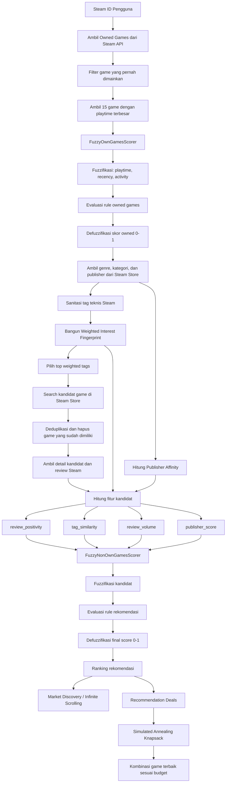

# Laporan Akhir: Steam Game Recommender System

## 1. Pendahuluan

Steam Game Recommender adalah platform berbasis web yang menggunakan **Logika Fuzzy (Fuzzy Logic)** dan algoritma optimasi untuk memberikan rekomendasi game yang sangat personal. Sistem ini membedah library pengguna, menganalisis perilaku bermain, dan memprediksi tingkat ketertarikan terhadap game baru di Steam Store.

## 2. Arsitektur Algoritma Rekomendasi

Sistem ini mengadopsi arsitektur **Dual-Scorer Fuzzy Logic**. Intinya, sistem tidak langsung merekomendasikan game hanya karena genre-nya mirip. Algoritma terlebih dahulu mempelajari game yang benar-benar bermakna di library pengguna, mengubahnya menjadi profil minat berbobot, lalu memakai profil tersebut untuk menilai kandidat game baru dari Steam Store.

Dua scorer dipakai karena dua masalahnya berbeda:

- `FuzzyOwnGamesScorer` menjawab pertanyaan: "Seberapa besar game yang sudah dimiliki ini mencerminkan minat pengguna?"
- `FuzzyNonOwnGamesScorer` menjawab pertanyaan: "Seberapa layak game yang belum dimiliki ini direkomendasikan berdasarkan profil pengguna dan kualitas publiknya?"



### 2.1. Orkestrasi Pipa Rekomendasi

Transformasi dari data Steam menjadi rekomendasi dilakukan dalam lima tahap berikut:

1. **Profiling Library Pengguna**:
   Sistem mengambil game yang dimiliki pengguna, lalu memprioritaskan game yang pernah dimainkan. Untuk efisiensi API, profil utama dibangun dari 15 game dengan `playtime_forever` terbesar. Setiap game tersebut dinilai dengan `FuzzyOwnGamesScorer` agar game yang sering dimainkan, masih relevan, dan aktif akhir-akhir ini memberi pengaruh lebih besar daripada game yang hanya pernah dicoba.
2. **Pembentukan Weighted Interest Fingerprint**:
   Detail Steam Store dari game historis dipakai untuk mengambil genre dan kategori. Setiap tag memperoleh bobot dari skor fuzzy game pemicunya. Jika sebuah tag muncul pada beberapa game yang skornya tinggi, bobot tag tersebut ikut naik. Tag teknis Steam seperti _Steam Achievements_, _Steam Cloud_, _Remote Play_, _Trading Cards_, dukungan controller, _LAN PvP_, dan _LAN Co-op_ disaring karena bukan sinyal genre/minat.
3. **Pengambilan Kandidat dari Steam Store**:
   Sistem memilih tag profil teratas, lalu mencari game di Steam berdasarkan tag tersebut dengan urutan review tertinggi. Kandidat yang sudah dimiliki pengguna dihapus, kandidat duplikat digabung, dan detail kandidat diambil kembali dari Steam untuk memperoleh metadata yang lebih lengkap.
4. **Inferensi Kandidat Baru**:
   Tiap kandidat dinilai oleh `FuzzyNonOwnGamesScorer` menggunakan empat input: `review_positivity`, `tag_similarity`, `review_volume`, dan `publisher_score`. Skor akhir bukan rata-rata sederhana; skor berasal dari rule fuzzy yang menyeimbangkan kecocokan selera personal, kualitas review, keyakinan statistik dari jumlah review, dan affinity terhadap publisher.
5. **Ranking dan Optimasi Deals**:
   Kandidat diurutkan berdasarkan skor fuzzy akhir. Pada mode Recommendation Deals, kandidat yang sedang diskon diproses lagi sebagai masalah optimasi anggaran: sistem memilih kombinasi game dengan nilai rekomendasi terbaik tanpa melewati budget pengguna.

---

### 2.2. Sistem Inferensi Logika Fuzzy

Setiap variabel input awalnya berupa angka tegas (_crisp_), misalnya `playtime_forever = 1200 menit` atau `review_positivity = 0.84`. Angka tersebut sulit langsung dipakai sebagai keputusan karena batas antar-kategori tidak selalu tajam. Karena itu, sistem mengubah angka menjadi derajat keanggotaan fuzzy menggunakan fungsi trapezoidal ($TrapMF$).

Contoh interpretasi:

- `playtime = 12000 menit` dapat memiliki keanggotaan tinggi pada kategori `sangat_banyak`.
- `review_positivity = 0.65` dapat mulai masuk kategori `bagus`, tetapi belum sepenuhnya kuat.
- `tag_similarity = 0.30` dapat dianggap `lumayan`, bukan langsung gagal total.

#### Persamaan Keanggotaan Trapezoidal:

```math
\mu_A(x; a, b, c, d) = \begin{cases}
0, & x \le a \text{ atau } x \ge d \\
\frac{x-a}{b-a}, & a < x < b \\
1, & b \le x \le c \\
\frac{d-x}{d-c}, & c < x < d
\end{cases}
```

#### Alasan Desain:

- **Toleransi Plateau**: Bagian puncak datar $(b \le x \le c)$ mentolerir rentang derau (noise) alami dari tabiat bermain tanpa menyebabkan distorsi skor yang tidak stabil.
- **Komputasi Orde-1**: Model polinomial konstan/linear ini sangat ringan dieksekusi secara masif di ranah _Edge Computing_ (Cloudflare Workers).
- **Transisi Gradual**: Nilai di sekitar batas kategori tidak berubah secara ekstrem. Game dengan review 79% dan 81% tidak diperlakukan sebagai dua kelas yang sepenuhnya berbeda.

#### Tahapan Inferensi

Untuk setiap scorer, proses fuzzy berjalan dengan pola yang sama:

1. **Fuzzifikasi**: input numerik diubah menjadi derajat keanggotaan pada beberapa label linguistik.
2. **Evaluasi Rule**: setiap rule memakai operator AND berbasis minimum. Jika sebuah rule membutuhkan `similarity = cocok` dan `review = bagus`, maka kekuatan rule adalah nilai terkecil dari dua keanggotaan tersebut.
3. **Agregasi Output**: beberapa rule bisa menghasilkan output yang sama, misalnya `TINGGI`. Sistem mengambil aktivasi terbesar untuk tiap output.
4. **Defuzzifikasi**: aktivasi output dikonversi menjadi skor numerik 0 sampai 1 memakai weighted average.

### 2.2.1. Rule Base & Filosofi Keputusan

Untuk menjamin kualitas dan rasionalitas rekomendasi, pembobotan fuzzy dievaluasi melalui pendekatan berbasis keahlian domain (expert-based rules) terkait perilaku gamer.

**Logika untuk Owned Games (Library Profiling):**
Sistem tidak menganggap semua game di library sebagai sinyal minat yang sama kuat. Game yang dibeli tetapi tidak pernah dimainkan seharusnya tidak memengaruhi profil sebesar game yang benar-benar dimainkan. Karena itu, scorer melihat tiga sinyal:

- `playtime`: total durasi main relatif terhadap game paling sering dimainkan pengguna.
- `recency`: jumlah hari sejak terakhir dimainkan.
- `activity`: durasi main dalam dua minggu terakhir relatif terhadap aktivitas tertinggi.

Filosofi rule-nya:

- **SANGAT TINGGI**: game sangat banyak dimainkan dan baru dimainkan, atau sering dimainkan dengan aktivitas dua minggu terakhir yang sangat kuat.
- **TINGGI**: game punya playtime besar dan masih cukup relevan, atau sering dimainkan serta masih aktif.
- **SEDANG**: game cukup dimainkan, tetapi sinyal recency/activity tidak cukup kuat untuk dianggap minat utama.
- **RENDAH**: game hanya dicoba, sudah lama tidak dimainkan, atau tidak punya aktivitas baru.
- **SANGAT RENDAH**: game tidak dimainkan, ditinggalkan sangat lama, atau tidak aktif sehingga tidak layak menjadi sumber utama profil.

**Logika untuk Non-Owned Games (Candidate Inference):**
Rekomendasi kandidat menjaga keseimbangan antara relevansi personal dan bukti kualitas publik:

- **Tag similarity adalah gerbang utama personalisasi**. Game dengan review sangat bagus tetap ditekan jika tag-nya tidak cocok dengan profil pengguna.
- **Review positivity mengukur kualitas**. Game dengan proporsi review positif tinggi lebih mudah naik, tetapi tetap membutuhkan similarity yang masuk akal.
- **Review volume mengukur keyakinan statistik**. Review positif dari 50 pengguna tidak sekuat review positif dari puluhan ribu pengguna, sehingga volume dipakai dalam skala logaritmik.
- **Publisher score berperan sebagai booster/tiebreaker**. Publisher favorit dapat menaikkan kandidat yang sudah relevan, tetapi tidak boleh sendirian membuat game tidak relevan menjadi rekomendasi utama.
- **Mixed/buruk diberi penalti**. Kandidat dengan review `mixed` hanya bisa bertahan di level sedang jika similarity sangat kuat dan volume review mendukung.

---

### 2.3. Ekstraksi Fitur: Profiling Kepemilikan (Owned Games)

Faktor determinan untuk modul `FuzzyOwnGamesScorer`:

| Variabel             | Unit Basis       | Justifikasi Semantik                                                                                                       |
| :------------------- | :--------------- | :------------------------------------------------------------------------------------------------------------------------- |
| **Playtime Forever** | Menit            | Jam terbang kumulatif dalam menit. Digunakan untuk menilai seberapa dalam pengguna mendalami game tersebut.                |
| **Recency**          | Hari $(t)$       | Jumlah hari sejak game terakhir dimainkan. Merepresentasikan relevansi ketertarikan aktif dan mengurangi "nostalgia bias". |
| **Recent Activity**  | Menit (2 Minggu) | Intensitas bermain dalam dua minggu terakhir (menit). Memberikan insentif kuat pada minat game baru/hype.                  |

Berbeda dengan pendekatan normalisasi klasik, sistem ini menggunakan nilai **raw** (mentah) yang langsung dipetakan ke fungsi keanggotaan fuzzy. Hal ini dilakukan karena batas-batas psikologis gamer (seperti "300 menit untuk mencoba" atau "100 jam untuk sangat banyak") bersifat absolut dan tidak tergantung pada perbandingan antar game di library.

Jika `rtime_last_played` tidak tersedia, sistem memakai nilai konservatif 365 hari agar game tersebut tidak dianggap baru dimainkan.

### 2.4. Ekstraksi Fitur: Skor Prediktif (Candidate Games)

Faktor determinan untuk modul `FuzzyNonOwnGamesScorer`:

| Variabel                | Domain         | Deskripsi Pemrosesan                                                                                                          |
| :---------------------- | :------------- | :---------------------------------------------------------------------------------------------------------------------------- |
| **Review Positivity**   | $[0, 1]$       | Reputasi kualitas (ulasan positif / ulasan total). Jika metadata gagal diraih dari Steam, diset netral ke `0.5`.              |
| **Weighted Similarity** | Overlap        | Kalkulasi kesamaan kandidat terhadap _Weighted Tag Fingerprint/Profile_ dari pengguna. (Lihat Section 2.5).                   |
| **Review Volume**       | $\log_{10}(x)$ | Skala logaritma guna meredam disparitas statistik antara game _indie_ (sedikit review) dan _AAA_ (ratusan ribu review).       |
| **Publisher Score**     | $[0, 1]$       | Probabilitas minat berlandaskan loyalitas terhadap suatu _brand_/entitas. Diambil dari modul kalkulasi Profile (Section 2.5). |

Kategori fuzzy kandidat dibentuk sebagai berikut:

- `review_positivity`: `buruk`, `mixed`, `bagus`, `sangat_bagus`.
- `tag_similarity`: `tidak_cocok`, `lumayan`, `cocok`, `sangat_cocok`.
- `review_volume`: `sedikit`, `sedang`, `banyak` berdasarkan $\log_{10}(review\_volume)$.
- `publisher_score`: `low`, `medium`, `high`.

---

### 2.5. Metodologi Matematika Terapan

#### 2.5.1. Normalisasi Loyalitas Publisher

Skor loyalitas publisher dihitung dari game historis yang publisher-nya berhasil diambil dari Steam Store. Untuk setiap publisher, sistem menghitung rata-rata skor fuzzy game yang dibobotkan oleh playtime. Artinya, publisher dari game yang lama dimainkan dan punya skor owned tinggi akan memperoleh affinity lebih besar.

```math
Score_{pub} = \frac{\sum_{i=1}^{n_{pub}} (Score_i \cdot P_i)}{\sum_{i=1}^{n_{pub}} P_i}
```

Setelah itu, semua publisher dinormalisasi terhadap publisher dengan skor tertinggi di profil pengguna:

```math
NormalizedScore_{pub} = \min\left(1, \frac{Score_{pub}}{\max(Score_{\text{all\_pubs}})}\right)
```

#### 2.5.2. Weighted Tag Similarity

Alih-alih menggunakan _Jaccard Index_ murni, algoritma memakai **Weighted Overlap Coefficient**. Tujuannya bukan sekadar menghitung berapa banyak tag yang sama, tetapi seberapa penting tag yang sama tersebut dalam profil pengguna.

Misalnya, jika profil pengguna sangat berat pada `RPG` dan `Open World`, kandidat yang cocok pada dua tag itu harus lebih dihargai daripada kandidat yang hanya cocok pada tag berbobot kecil. Karena itu, pembilang menjumlahkan bobot tag kandidat yang beririsan dengan profil pengguna:

```math
IntersectionWeight = \sum_{t \in (T_C \cap T_U)} W_U(t)
```

Penyebut memakai jumlah bobot top-N dari profil pengguna, dengan $N$ sama dengan jumlah tag kandidat yang lolos filter. Ini membuat skor tetap proporsional terhadap tag paling penting milik pengguna:

```math
MaxPossibleWeight = \sum_{i=1}^{|T_C|} W_U(\text{sorted\_top}_i)
```

```math
Similarity(T_C, T_U) = \frac{IntersectionWeight}{MaxPossibleWeight}
```

Sebelum perhitungan, sistem melakukan normalisasi dan sanitasi tag:

```math
T_C' = \{t \in T_C \mid t \notin T_{excluded}\}
```

```math
T_U' = \{t \in T_U \mid t \notin T_{excluded}\}
```

Set $T_{excluded}$ berisi kategori teknis Steam, misalnya _Steam Achievements_, _Steam Trading Cards_, _Steam Cloud_, _Remote Play_, _In-App Purchases_, _controller support_, _Steam Leaderboards_, _VR-only_, serta kategori jaringan teknis seperti _LAN PvP_ dan _LAN Co-op_. Langkah ini penting karena kategori tersebut menjelaskan fitur platform, bukan preferensi genre. Dengan demikian, nilai similarity tidak bias oleh metadata non-semantik.

#### 2.5.3. Defuzzifikasi Rekomendasi (Final Score)

Setelah rule dievaluasi, sistem memiliki aktivasi untuk lima label output:

| Output          | Bobot Numerik |
| :-------------- | :------------ |
| `SANGAT_RENDAH` | 0.1           |
| `RENDAH`        | 0.3           |
| `SEDANG`        | 0.5           |
| `TINGGI`        | 0.7           |
| `SANGAT_TINGGI` | 0.9           |

Sistem menggunakan _Mamdani-style Weighted Average_ untuk mengubah aktivasi label menjadi skor final:

```math
FinalScore = \frac{\sum_{j=1}^m \mu_{\text{activation}, j} \cdot w_j}{\sum_{j=1}^m \mu_{\text{activation}, j}}
```

**Karakteristik Penilaian Tambahan**:

1. **Fallback berbeda per konteks**: Pada `FuzzyOwnGamesScorer`, jika tidak ada rule aktif, skor fallback adalah `0.5` agar game historis tidak langsung dianggap buruk karena data tidak lengkap. Pada `FuzzyNonOwnGamesScorer`, fallback adalah `0` agar kandidat baru yang tidak punya bukti cukup tidak naik ke rekomendasi.
2. **Cross-check personalisasi**: Aturan fuzzy meminimalkan skor apabila sebuah game bereputasi sangat tinggi, tetapi tidak mewakili genre preferensi utama di profil.
3. **Auditability**: Setiap hasil detailed scorer menyimpan input, membership, rule activation, numerator, denominator, dan skor akhir. Data ini dipakai oleh modal analisis di UI untuk menjelaskan kenapa sebuah game memperoleh skor tertentu.

---

## 3. Fitur Utama & Optimasi

### 3.1. Recommendation & Infinite Scrolling

Mesin pencarian yang mendukung eksplorasi tak terbatas:

- **Aggressive Offset**: Halaman berikutnya disuplai lompatan acuan statis (_start offset_) dari populasi yang luas untuk menghindari perulangan popularitas yang sama (no-collusion bias).
- **Client-side Auto-Fetch & Deduplikasi**: Apabila respons _Server-Side Rendering_ terbatas oleh sistem batasan rate, komponen `InfiniteGrid` otomatis mendobrak muatan mandiri. Mekanisme deduplikasi memblokir penumpukan elemen antarmuka dari ID Game duplikat.
- **Source Data Transparency**: Halaman Recommendation menampilkan ringkasan sumber data tepat di bawah input budget, berupa top weighted tags dari library pengguna. Panel ini menjelaskan bahwa rekomendasi berasal dari gabungan tag historis berbobot fuzzy, review Steam, volume review, dan affinity publisher.
- **Clickable Recommendation Analysis**: Setiap kartu game rekomendasi, baik pada _Optimized Selection_ maupun _Market Discovery_, dapat dibuka menjadi modal analisis. Modal tersebut menampilkan perhitungan fuzzy dalam notasi LaTeX dari input sampai output, mencakup `review_positivity`, `tag_similarity`, `review_volume`, `log_review_volume`, dan `publisher_score`.

### 3.2. Recommendation Deals (Simulated Annealing)

Menyelesaikan problem _Knapsack Kombinasi Promosi_ lewat optimasi Meta-Heuristik probabilistik **Simulated Annealing**:

Fungsi Energi ($E$) memprioritaskan densitas kelayakan ($\frac{Score}{Price}$) dengan normalisasi utilitas anggaran $(\frac{Cost}{Budget})^2$:

```math
E(items) = \begin{cases}
-\infty (\text{NEGATIVE\_INFINITY}), & \text{jika } Cost > Budget \\
\left(\sum \frac{Score}{Price}\right) \times \left(\frac{Cost}{Budget}\right)^2, & \text{lainnya}
\end{cases}
```

Penerimaan probabilitas _Neighbor State_ yang bertransformasi semakin buruk difilter via fungsi kurva termodinamika ($T$ dengan $CoolingRate \approx 0.998$):

```math
P(\text{Accept}) = \exp \left( \frac{E_{\text{neighbor}} - E_{\text{current}}}{T} \right)
```

Proposisi penalti _Negative Infinity_ menghilangkan celah cacat toleransi pada kondisi total kombinasi di atas bajet batas.

### 3.3. Penyelarasan Peta Index Asynchronous

Pada orkestrasi pemrosesan paralel lewat `Promise.all()`, array _candidate reviews_ dipasangkan ke objek detail awal (pre-pairing) terlebih dahulu ketimbang setelah filter kondisi (_price_overview_). Pola ini berhasil menjamin resolusi tidak ada inkonsistensi pertukaran index ulasan ke entitas game akibat filter asimetris.

### 3.4. Stabilitas Produksi Edge / Caching & Rate-Limit Tollerance

Untuk menangani limitasi IP Datacenter, CPU, dan timeout pada Cloudflare Workers:

- **Sequential Request Handling**: Modifikasi dari `Promise.all()` menjadi pola tunggu berurutan untuk pengambilan hasil pencarian API Store Steam nhằm mencegah limitasi pertahanan (Cloudflare 429 _Too Many Requests_) terhadap server.
- **No-Collusion Popularity Bias**: Pencarian algoritma menggunakan offset yang lebih besar dan komprehensif, menghilangkan proses _slice_ dini yang berisiko membuat kandidat jadi kosong apabila pengguna sudah memiliki semua rekomendasi top 10 (bias popularitas elit).
- **Triage Invalidation Cache KV**: Memisahkan Cache KV dan memberikan pengecekan yang lebih ketat agar meretur nilai kosong (bila memang diblokir Steam API) tidak meracuni dan me-lock memori KV selama periode 7 Hari berturut-turut.
- **Graceful Fallbacks**: Rute `/recommendation` maupun perhitungan review kini telah diinjeksikan mekanisme cadangan (skor `0.5` bila di-reject) ketimbang _panic shutdown_, mencegah kasus UI Blank State.

### 3.5. Analyzer (Library Deep-Dive)

Halaman sentral untuk meninjau secara gamblang preferensi pengguna hasil dari kalkulasi Fuzzy Scorer. Selain mendistribusikan skor kecocokan game di masa lalu, Analyzer juga memvisualisasikan:

- **Top 12 Preferred Tags**: Diekstrak dari riwayat jam terbang menggunakan fungsi algoritma sentral `buildUserProfile`. Tag disajikan berdampingan dan memberikan insight mendalam tentang _genre_ yang paling mendominasi.
- **Top 8 Affinity Publishers**: Menyajikan relasi antara loyalitas (_playtime_) dan penilaian pengguna atas game yang dirilis tiap perusahaan, lengkap dengan grafik progres bar.
- **Mathematical Process Audit**: Kartu game pada Analyzer membuka modal perhitungan yang tidak lagi memakai pecahan _floating cards_, melainkan alur LaTeX penuh. Urutannya adalah input mentah, fungsi keanggotaan trapezoidal, aktivasi rule Mamdani, agregasi output, hingga defuzzifikasi akhir.

### 3.6. Sanitasi Tag dan Konsistensi Metadata

Seluruh jalur rekomendasi menerapkan filter tag yang sama:

- **Profile Source Tags**: Top tags yang tampil pada Recommendation disaring dari kategori teknis Steam agar tidak menampilkan metadata non-genre.
- **Candidate Tags**: Tags kandidat pada rute `/recommendation`, `/api/recommendation-deals`, dan helper `getSimpleRecommendations` difilter ulang setelah proses penggabungan genre dan kategori.
- **Matched Tags**: Daftar tag yang menjelaskan kecocokan kandidat hanya mengambil tag yang lolos filter dan benar-benar ditemukan dalam bobot profil pengguna.

Konsistensi ini memastikan bahwa _similarity score_ dan penjelasan visual di UI mengacu pada sumber data yang sama. Dengan kata lain, tag seperti _Steam Cloud_ atau _Steam Achievements_ tidak dapat menaikkan skor maupun muncul sebagai alasan rekomendasi.

## 4. Struktur Database & Refactoring Redundansi

Seiring dengan evolusi proyek, sistem melalui _streamlining_ fitur. Halaman yang dinilai duplikatif atau redundan (seperti `Engine`, `Co-op`, dan `Tierlist`) telah dihapus secara permanen dari _repository_ agar fokus pengembangan tertuju pada optimasi kualitas `Analyzer` dan `Recommendation`.
Efisiensi arsitektur ini juga merambah hingga skema database SQLite (D1) melalui migrasi relasional: menghapus kolom `engine_params` tak terpakai dan merename `deals_params` menjadi `recommendation_params`.

## 5. Kesimpulan

Dengan menggabungkan Logika Fuzzy untuk penilaian subjektif dan algoritma heuristik untuk optimasi data, Steam Game Recommender mampu mentransformasi data mentah Steam menjadi pengalaman penemuan game yang benar-benar personal dan akurat.
