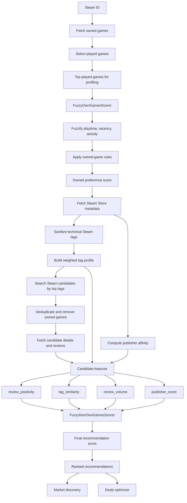

# Steam Game Recommender

Steam Game Recommender is a web-based recommendation system that analyzes a user's Steam library and discovers new Steam Store games using **Fuzzy Logic**. The system builds a weighted preference profile from games the user actually plays, then scores new candidates using personal tag similarity, Steam review quality, review volume, and publisher affinity.

## Features

- **Analyzer**: Scores owned games with `FuzzyOwnGamesScorer` using playtime, recency, and recent activity.
- **Weighted Preference Profile**: Builds user interest fingerprints from Steam genres/categories, weighted by fuzzy scores from owned games.
- **Steam Tag Sanitization**: Removes technical platform tags such as Steam Cloud, Trading Cards, Remote Play, controller support, LAN PvP, and LAN Co-op so recommendations are based on genre and preference signals.
- **Recommendation Discovery**: Searches Steam Store candidates from the user's strongest weighted tags, removes already-owned games, and ranks candidates with `FuzzyNonOwnGamesScorer`.
- **Recommendation Deals**: Uses a Simulated Annealing knapsack optimizer to select discounted games that fit the user's budget.
- **Transparent Scoring**: Recommendation and analyzer cards expose the fuzzy calculation process, including fuzzification, rule activation, aggregation, and defuzzification.

## Recommendation Flow



## Algorithm Overview

The system uses a **dual-scorer fuzzy architecture**:

### 1. `FuzzyOwnGamesScorer`

Evaluates games already owned by the user.

- **Inputs**: `playtime_forever` (minutes), `playtime_2weeks` (minutes), `days_since_played` (days).
- **Fuzzy labels**: examples include `tidak_dimainkan`, `dicoba`, `cukup`, `sering`, `sangat_banyak`, `baru_main`, and `ditinggal`.
- **Output**: a 0-1 preference score used to weight tags and publisher affinity.

### 2. Weighted Tag Similarity

Candidate games are compared against the user's weighted profile using a **Weighted Overlap Coefficient**, not plain Jaccard similarity. Matching a high-weight user tag such as `RPG` contributes more than matching a low-weight tag.

```math
Similarity(T_C, T_U) = \frac{\sum_{t \in (T_C \cap T_U)} W_U(t)}{\sum_{i=1}^{|T_C|} W_U(\text{sorted\_top}_i)}
```

### 3. `FuzzyNonOwnGamesScorer`

Predicts how suitable a Steam Store candidate is.

- **Inputs**: `review_positivity`, `tag_similarity`, `review_volume`, `publisher_score`.
- **Review volume**: transformed with `log10` so popular AAA games do not overpower smaller games purely by raw review count.
- **Publisher score**: acts as a booster or tiebreaker, not the primary recommendation signal.
- **Output**: a 0-1 recommendation score.

## Tech Stack

- **Runtime**: Cloudflare Workers
- **Framework**: Hono
- **Frontend**: React with SSR and hydration
- **Build Tool**: Vite
- **Logic**: Custom TypeScript fuzzy inference engine
- **Database**: Cloudflare D1
- **Cache**: Cloudflare KV
- **Tests**: Vitest

## Development

```bash
npm install
npm run dev
```

Run tests:

```bash
npm test
```

Build for production:

```bash
npm run build
```

Deploy with Wrangler:

```bash
npm run deploy
```
